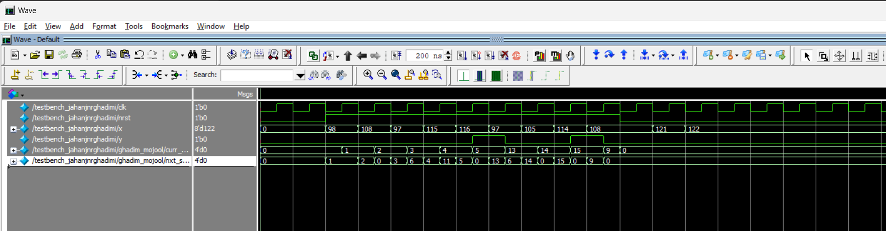
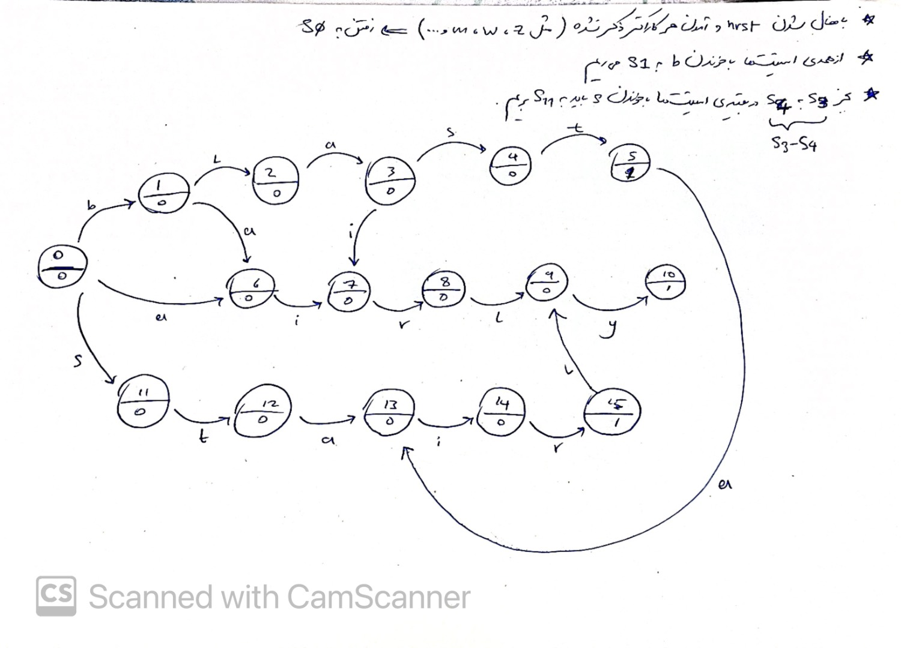

# Assignment 02: Moore Sequence Detector

This assignment implements a Moore finite-state detector in Verilog. The detector consumes 8-bit ASCII input values and raises `y` when the state machine reaches matching terminal states. The encoded transitions in `detector.v` cover strings visible from the source comments, including `blast`, `airly`, and `stair`.

## Files

| File | Purpose |
| --- | --- |
| `detector.v` | Moore FSM implementation (`detector_moore`) |
| `testbench.v` | Testbench that drives reset, clock, and ASCII input bytes |
| `stateMachine.jpeg` | State machine diagram |
| `wave.png` | ModelSim waveform screenshot |

## Running

The project is a simple Verilog simulation. From this directory, compile the detector and testbench with a Verilog simulator. For example, Icarus Verilog accepts:

```sh
iverilog -g2012 -o /tmp/dsd_hw2.vvp detector.v testbench.v
vvp /tmp/dsd_hw2.vvp
```

The existing screenshot below shows the ModelSim waveform view for the provided testbench.



The state machine diagram is also included:


