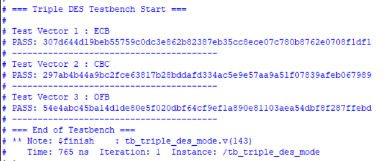

# Assignment 03: Triple DES Modes

This assignment contains a DES core wrapper and a Triple DES mode controller for 256-bit data blocks. The testbench exercises ECB, CBC, and OFB modes with expected output vectors printed by the simulation.

The original HDL is kept in the nested `dsd-hw3-G4/` directory.

## Files

| File | Purpose |
| --- | --- |
| `dsd-hw3-G4/main.v` | DES support modules and a small DES testbench |
| `dsd-hw3-G4/triple_des_mode.v` | Triple DES mode controller |
| `dsd-hw3-G4/tb_triple_des_mode.v` | Testbench for ECB, CBC, and OFB vectors |
| `dsd-hw3-G4/ecb.png` | ECB waveform screenshot |
| `dsd-hw3-G4/cbc.png` | CBC waveform screenshot |
| `dsd-hw3-G4/ofb.png` | OFB waveform screenshot |
| `dsd-hw3-G4/result.png` | Console output screenshot showing PASS messages |

## Running

Compile from `dsd-hw3-G4/` so relative includes resolve as intended:

```sh
cd dsd-hw3-G4
iverilog -g2012 -o /tmp/dsd_hw3.vvp triple_des_mode.v tb_triple_des_mode.v
```

In the current checkout, this command does not complete because `main.v` includes helper files (`E.v`, `P.v`, `S1.v` through `S8.v`, `IP.v`, `IP_inv.v`, `PC1.v`, and `PC2.v`) that are not present inside this assignment folder. Similar helper files are present in Assignment 04, but they were not copied here to preserve the original layout.

## Screenshots



Mode-specific waveform screenshots are available:

- [ECB waveform](dsd-hw3-G4/ecb.png)
- [CBC waveform](dsd-hw3-G4/cbc.png)
- [OFB waveform](dsd-hw3-G4/ofb.png)
