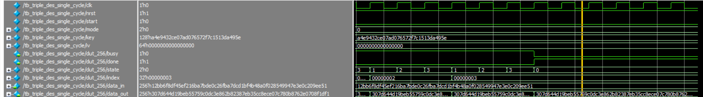
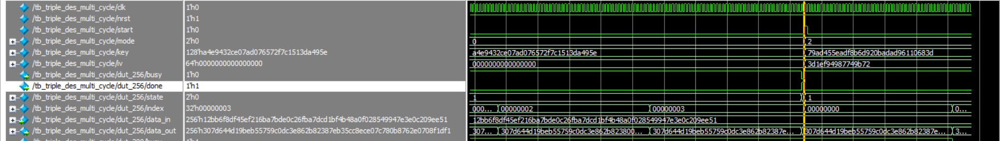
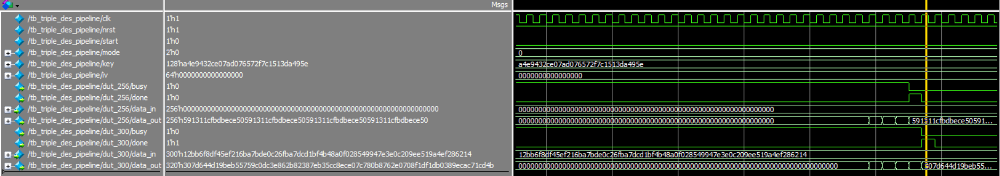

# Assignment 04: Triple DES Architecture Variants

This assignment extends the Triple DES work with single-cycle, multi-cycle, and pipelined implementations. The project includes DES permutation/S-box helper modules, implementation variants, testbenches, ModelSim scripts, waveform screenshots, and generated simulation outputs.

The original HDL is kept in the nested `dsd-hw4-G4/` directory.

## Files

| File or group | Purpose |
| --- | --- |
| `dsd-hw4-G4/E.v`, `P.v`, `S1.v`-`S8.v`, `IP.v`, `IP_inv.v`, `PC1.v`, `PC2.v` | DES helper modules |
| `dsd-hw4-G4/main.v` | DES core and supporting modules |
| `dsd-hw4-G4/triple_des_mode.v` | Baseline Triple DES mode implementation |
| `dsd-hw4-G4/triple_des_single_cycle.v` | Single-cycle-style variant |
| `dsd-hw4-G4/triple_des_multi_cycle.v` | Multi-cycle variant |
| `dsd-hw4-G4/triple_des_pipeline.v` | Pipelined variant |
| `dsd-hw4-G4/tb_*.v` | Testbenches for the variants |
| `dsd-hw4-G4/run_single.tcl`, `run_multi.tct`, `run_pipeline.tcl` | ModelSim run scripts |
| `dsd-hw4-G4/*.png` | Existing waveform screenshots |
| `dsd-hw4-G4/*.vcd`, `vsim.wlf`, `work/` | Generated simulation artifacts preserved from the original folder |

## Running

Use the assignment's nested HDL directory as the simulator working directory:

```sh
cd dsd-hw4-G4
vsim -do run_single.tcl
vsim -do run_pipeline.tcl
```

The multi-cycle script is named `run_multi.tct` in the original files. If using ModelSim, open it explicitly or rename only in a separate cleanup step after checking references.

Icarus Verilog can compile the top-level variants from this directory:

```sh
iverilog -g2012 -o /tmp/dsd_hw4_single.vvp triple_des_single_cycle.v tb_triple_des_single_cycle.v
iverilog -g2012 -o /tmp/dsd_hw4_multi.vvp triple_des_multi_cycle.v tb_triple_des_multi_cycle.v
iverilog -g2012 -o /tmp/dsd_hw4_pipeline.vvp triple_des_pipeline.v tb_triple_des_pipeline.v
```

The testbenches contain `$stop`, so command-line `vvp` runs may enter an interactive stop unless the bench is adjusted for noninteractive execution.

## Screenshots

Representative waveform screenshots:







Additional screenshots are available in the same directory: `single2.png`, `single3.png`, `single4.png`, `multi2.png`, `multi3.png`, and `multi4.png`.
