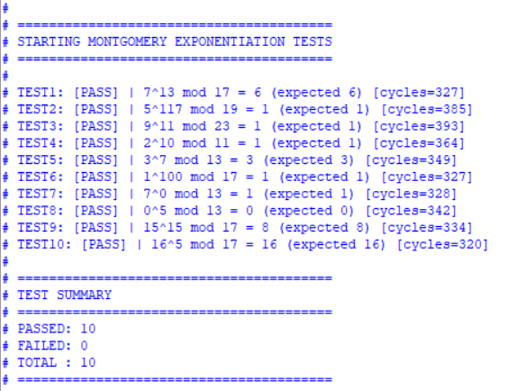
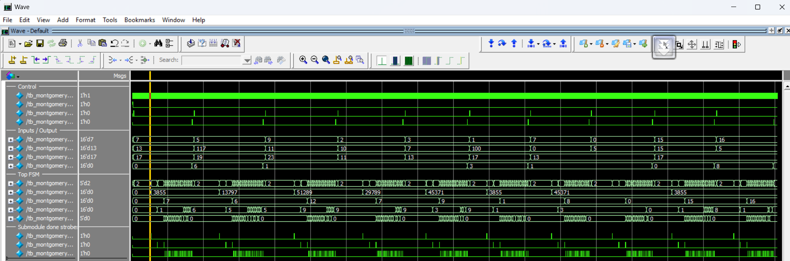

# Assignment 05: Montgomery Modular Exponentiation

This assignment implements a Montgomery modular exponentiation datapath in Verilog. The design is organized around `montgomery_exp_top.v` and helper modules for Karatsuba multiplication, non-restoring division, extended GCD, modular inverse, and Montgomery multiplication.

The original project files are kept in the nested `dsd/` directory.

## Files

| File or group | Purpose |
| --- | --- |
| `dsd/montgomery_exp_top.v` | Top-level Montgomery exponentiation controller |
| `dsd/montgomery_mul.v` | Montgomery multiplication module |
| `dsd/modular_inverse.v`, `extended_gcd.v`, `non_restoring_div.v` | Modular arithmetic helper modules |
| `dsd/karatsuba_mul.v` | Multiplier helper module |
| `dsd/tb_montgomery_exp.v` | Testbench with ten modular exponentiation test cases |
| `dsd/Makefile`, `run.sh` | Icarus Verilog compile/run helpers |
| `dsd/run.tcl` | ModelSim compile/simulate script |
| `dsd/report.png` | Console result screenshot |
| `dsd/wave.png` | ModelSim waveform screenshot |
| `dsd/sim.out`, `tb_montgomery_exp.vcd`, `vsim.wlf`, `work/` | Generated simulation artifacts preserved from the original folder |

## Running

Use the nested `dsd/` directory as the working directory:

```sh
cd dsd
make compile
make run
```

The same folder also contains `run.sh` for an Icarus Verilog flow and `run.tcl` for ModelSim:

```sh
cd dsd
./run.sh
vsim -do run.tcl
```

`run.sh` and `make clean` remove generated files such as `sim.out` and `tb_montgomery_exp.vcd`, so use them only when it is acceptable to regenerate simulation outputs.

## Screenshots



The ModelSim waveform screenshot is also available:


