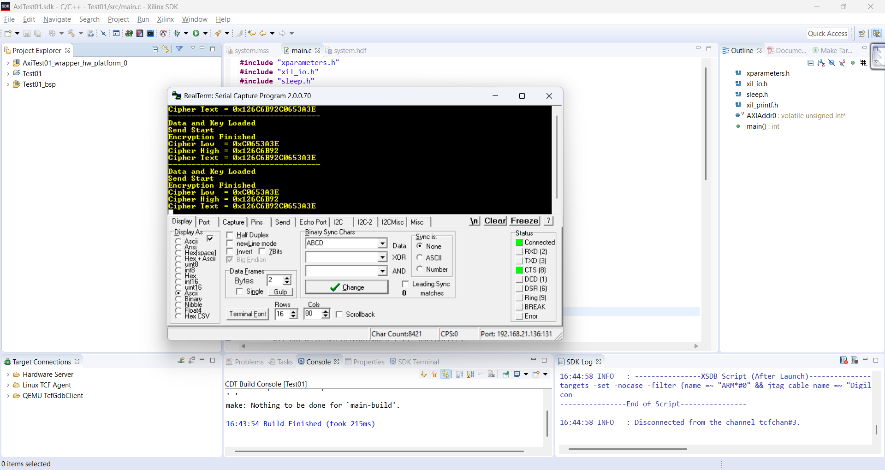

# Assignment 06: TEA Encryption Vivado Project

This assignment contains a Xilinx Vivado project named `AxiTest01` with a Tiny Encryption Algorithm (TEA) encryption module. The included screenshot shows Xilinx SDK and RealTerm output after loading data/key values, starting encryption, and reading the ciphertext.

The original Vivado project is kept in the nested `AxiTest01/` directory.

## Files

| File or group | Purpose |
| --- | --- |
| `AxiTest01/AxiTest01.xpr` | Vivado project file |
| `AxiTest01/tea_encrypt.v` | Verilog TEA encryption module |
| `AxiTest01/tea_encrypt.vhd` | VHDL TEA-related source present in the project folder |
| `AxiTest01/AxiTest01.srcs/` | Vivado sources, block design, constraints, and generated IP files |
| `AxiTest01/AxiTest01.sdk/` | Xilinx SDK workspace files |
| `output.png` | SDK and RealTerm output screenshot |
| `AxiTest01/*.jou`, `*.log`, `.Xil/`, `*.runs/`, `*.cache/` | Vivado-generated artifacts preserved from the original folder |

## Opening

Open the Vivado project from this assignment directory:

```sh
vivado AxiTest01/AxiTest01.xpr
```

This project was inspected as a Vivado 2018.2 project targeting a Zynq-7010 style board configuration. Keep the nested `AxiTest01/` folder intact because the `.xpr` references block design, constraint, IP repository, generated run, and SDK paths inside that tree.

## Screenshot


