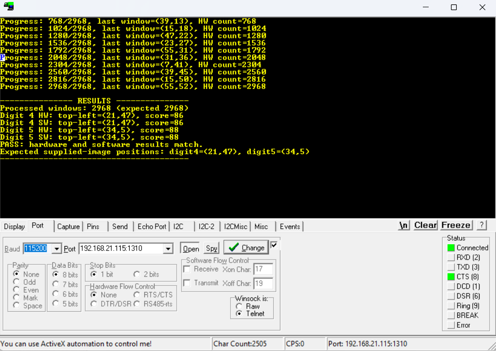

# Final Project: AXI4-Lite CNN Convolution

This project contains a Vivado/Xilinx SDK RemoteFPGA convolution design for group 4. The existing project documentation describes a custom AXI4-Lite slave, a convolution engine for digit detection, SDK software, and scripts for rebuilding/exporting the hardware platform.

The original submitted structure is preserved under `AXI4LiteSlaveCNN/`.

## Files

| File or group | Purpose |
| --- | --- |
| `AXI4LiteSlaveCNN/AXI4LiteSlaveADD/README-FA.md` | Existing Persian project documentation |
| `AXI4LiteSlaveCNN/AXI4LiteSlaveADD/README-CURRENT-FIX-FA.txt` | Notes about SDK hardware platform synchronization |
| `AXI4LiteSlaveCNN/AXI4LiteSlaveADD/build_final_project.tcl` | Vivado 2018.2 build/export script |
| `AXI4LiteSlaveCNN/AXI4LiteSlaveADD/AxiSlave/` | Custom AXI4-Lite IP project and RTL |
| `AXI4LiteSlaveCNN/AXI4LiteSlaveADD/AxiTest01/` | Vivado hardware project and SDK workspace |
| `AXI4LiteSlaveCNN/AXI4LiteSlaveADD/input-64x64.bmp` | Input image referenced by the project |
| `AXI4LiteSlaveCNN/realterm-output.png` | RealTerm output screenshot showing hardware/software result comparison |

## Opening

Open the main Vivado project from the preserved project tree:

```sh
vivado AXI4LiteSlaveCNN/AXI4LiteSlaveADD/AxiTest01/AxiTest01.xpr
```

The build script can be run from Vivado Tcl Shell when the required board files and Vivado 2018.2 environment are available:

```tcl
cd AXI4LiteSlaveCNN/AXI4LiteSlaveADD
source build_final_project.tcl
```

Do not move the nested Vivado, IP, or SDK folders independently. The project files and scripts contain relative references between `AxiSlave`, `AxiTest01`, SDK hardware platforms, exported bitstreams, and block design files.

## Screenshot


